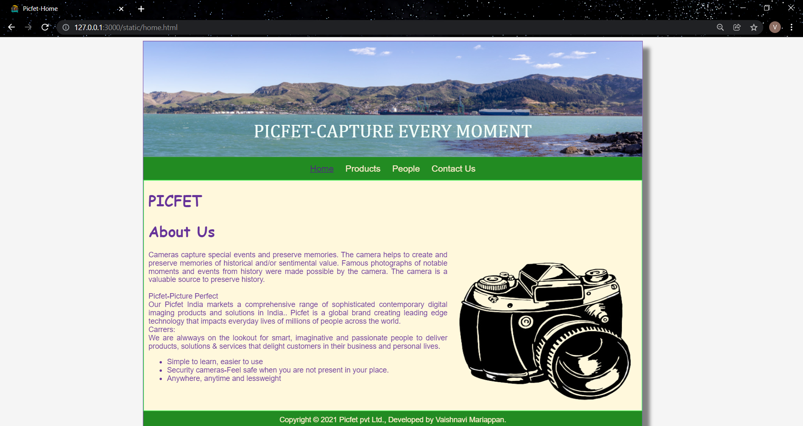
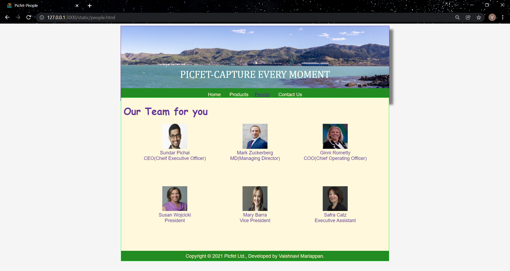
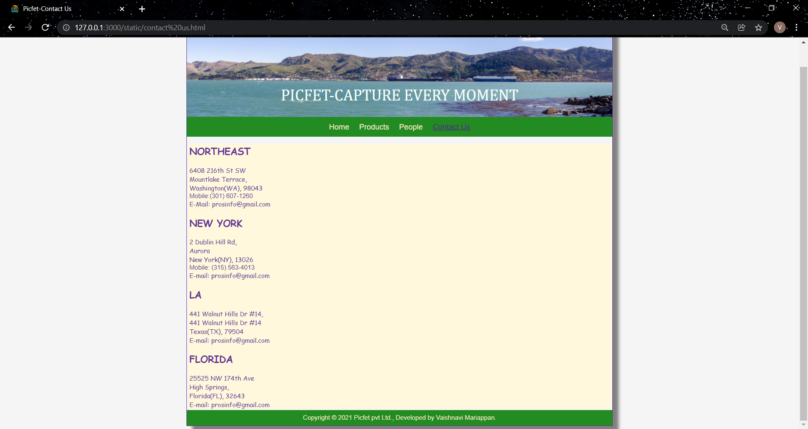

# Web Design for a Software Product Company

## AIM:

To design a static website for a software product company company.

## DESIGN STEPS:

### Step 1:

Requirement collection.

### Step 2:

Creating the layout using HTML and CSS.

### Step 3:

Updating the sample content.

### Step 4:

Choose the appropriate style and color scheme.

### Step 5:

Validate the layout in various browsers.

### Step 6:

Validate the HTML code.

### Step 6:

Publish the website in the given URL.

## PROGRAM :

### CSS CODE :
```
* {
  box-sizing: border-box;
  font-family: Arial, Helvetica, sans-serif;
}
body {
  background-color: whitesmoke;
  color:rebeccapurple;
  
}

.container {
  width: 1080px;
  margin-left: auto;
  margin-right: auto;
  border-width: 1px 1px 1px 1px;
  border-style: solid;
  box-shadow: 15px 15px 8px gray;
}
.banner {
  display: block;
  width: 100%;
  height: 250px;
  text-align: center;
  font-size: 40px;
  font-family: Cambria, Cochin, Georgia, Times, 'Times New Roman', serif;
  background-image: url("/static/img/banner4.jpg");
  background-size: 100% 100%;
  margin: 0px 0px 0px 0px;
  padding-top: 170px;
  color: mintcream;
  background-color:burlywood;
}
.bgimg {
  background-image: url("/static/img/banner4.jpg");
}

.menu {
  display: block;
  width: 100%;
  height: 50px;
  font-size: larger;
  background-color: forestgreen;
  text-align: center;
  padding-top: 15px;
  margin: 0px 0px 0px 0px;
  border-width: 1px;
}

.menuitem {
  display: inline-block;
  margin-left: 10px;
  margin-right: 10px;
}
.menuitemselected {
  display: inline-block;
  margin-left: 10px;
  margin-right: 10px;
  color: rgb(91, 10, 241);
}

.menuitem a {
  text-decoration: none;
  color: blanchedalmond;
}

.content {
  display: block;
  width: 100%;
  background-color: cornsilk;
  min-height: 500px;
  margin: 0px 0px 0px 0px;
  border-width: 1px;
  border-color: rgb(6, 243, 38);
  border-style: solid;
}
.homecontent {
  min-height: 400px;
  margin: 10px 10px 10px 10px;
}
.homecontent h1 {
  text-align: left;
  font-family: cursive;
}
.homecontent img {
  float: right;
  width: 400px;
  height: 350px;
  margin-left: 10px;
}

.contenttext {
  text-align: justify;
}

.productcontent {
  min-height: 500px;
  margin: 10px 10px 10px 10px;
}

.productcontent h1 {
  text-align: left;
}

.productitems {
  display: block;
}

.productitem {
  display: inline-block;
  width: 40%;
  height: 200px;
  text-align: center;
}

.productitem img {
  width: 150px;
  height: 150px;
  display: block;
}
.productitem .itemimage {
  display: block;
  margin-left: auto;
  margin-right: auto;
  width: 150px;
  margin-bottom: 5px;
}

.productitem .itemname {
  display: block;
}
.productitem .itemprice {
  display: block;
}
.peoplecontent {
  min-height: 500px;
  margin: 10px 10px 10px 10px;
}

.peoplecontent h1 {
  text-align: left;
  font-family: cursive;
}

.peopleitems {
  display: block;
}

.peopleitem {
  display:inline-block ;
  width: 30%;
  height: 250px;
  text-align: center;
}

.peopleitem img {
  width: 100px;
  height: 100px;
  display: block;
}
.peopleitem .peopleimage {
  display: block;
  margin-left: auto;
  margin-right: auto;
  width: 100px;
  margin-bottom: 5px;
}

.peopleitem .peoplename {
  display: block;
}
.peopleitem .peoplepos{
  display: block;
}
.Contactcontent {
  min-height: 500px;
  margin: 3px 3px 3px 3px;
  background-color: cornsilk;
}

.Contactcontent h2 {
  text-align: left;
  font-family: cursive;
}

.Contactitems {
  display: block;
}

.Contactitem {
  display:block;
  text-align: left;
}

.address {
  display: block;
  text-align: left;
  font-family: cursive;
}
.number {
  display: block;
  text-align: left;
}
.email {
  display: block;
  text-align: left;
  font-family: cursive;
}

.footer {
  display: block;
  width: 100%;
  height: 40px;
  background-color: forestgreen;
  text-align: center;
  padding-top: 10px;
  margin: 0px 0px 0px 0px;
  color:blanchedalmond;
}
```
### HOME PAGE HTML CODE :
```
<!DOCTYPE html>
<html lang="en">
  <head>
    <title>Picfet-Home</title>
    <link rel="stylesheet" href="./css/layout.css" />
    <link rel="icon" href="./img/icon.png" type="image/x-icon" />
  </head>

  <body>
    <div class="container">
      <div class="banner">PICFET-CAPTURE EVERY MOMENT</div>
      <div class="menu">
        <div class="menuitemselected"><a href="home.html">Home</a></div>
        <div class="menuitem"><a href="products.html">Products</a></div>
        <div class="menuitem"><a href="people.html">People</a></div>
        <div class="menuitem"><a href="contact us.html">Contact Us</a></div>
      </div>
      <div class="content">
        <div class="homecontent">
          <h1>PICFET</h1>
          <h1>About Us</h1>
          
          <div class="contenttext">
            Cameras capture special events and preserve memories.
            The camera helps to create and preserve memories of historical and/or sentimental value.
            Famous photographs of notable moments and events from history were made possible by the camera.
            The camera is a valuable source to preserve history.
            <br />
            <br/>
            Picfet-Picture Perfect
            <br/>
            Our Picfet India markets a comprehensive range of sophisticated contemporary digital imaging products and solutions in India..
            Picfet is a global brand creating leading edge technology that impacts everyday lives of millions of people across the world.
            <br/>
            Carrers:
            <br/>
            We are alwways on the lookout for smart, imaginative and passionate people to deliver products, solutions & services that delight customers in their
            business and personal lives.
            <ul>
              <li>Simple to learn, easier to use</li>
              <li>Security cameras-Feel safe when you are not present in your place.</li>
              <li>Anywhere, anytime and lessweight</li>
            </ul>
          </div>
        </div>
      </div>
      <div class="footer">
        Copyright &#169; 2021 Picfet pvt Ltd., Developed by Vaishnavi Mariappan.
      </div>
    </div>
  </body>
</html>
```
### PRODUCTS PAGE HTML CODE :
```
<!DOCTYPE html>
<html lang="en">
  <head>
    <title>Picfet-Products</title>
    <link rel="stylesheet" href="./css/layout.css" />
    <link rel="icon" href="./img/icon.png" type="image/x-icon" />
  </head>

  <body>
    <div class="container">
      <div class="banner">PICFET-CAPTURE EVERY MOMENT</div>
      <div class="menu">
        <div class="menuitem"><a href="home.html">Home</a></div>
        <div class="menuitemselected"><a href="products.html">Products</a></div>
        <div class="menuitem"><a href="people.html">People</a></div>
        <div class="menuitem"><a href="contact us.html">Contact Us</a></div>
      </div>
      <div class="content">
        <div class="productcontent">    
          <h1>Our Premium Products</h1>
          <div class="productitems">
              <div class="productitem"> 
                  <div class="itemimage">
                  
                  </div>
                <br/>
                  <div class="itemname">Picfet 750mm</div>
                  <div class="itemprice">Price: Rs.80,000.00 </div>
              </div>
              <div class="productitem"> 
                <div class="itemimage">
                
                </div>
              <br/>
                <div class="itemname">Picfet 1000mm</div>
                <div class="itemprice">Price: Rs.1,00,000.00 </div>
              </div>
              <div class="productitem"> 
                <div class="itemimage">
                
                </div>
                <br/>
                <div class="itemname">Picfet mini</div>
                <div class="itemprice">Price: Rs.50,000.00 </div>
              </div>
              <div class="productitem"> 
                <div class="itemimage">
                
                </div>
                <br/>
                <div class="itemname">Picfet security</div>
                <div class="itemprice">Price: Rs.75,000.00 </div>
              </div>
              <div class="productitem"> 
                <div class="itemimage">
                
                </div>
              <br/>
                <div class="itemname">Picfet 250</div>
                <div class="itemprice">Price: Rs.1,00,000.00 </div>
            </div>
              <div class="productitem"> 
                <div class="itemimage">
                
                </div>
                <br/>
                <div class="itemname">Picfet lens</div>
                <div class="itemprice">Price: Rs.50,000.00 </div>
              </div>
              <div class="productitem"> 
                <div class="itemimage">
                
                </div>
                <br/>
                <div class="itemname">Picfet lens</div>
                <div class="itemprice">Price: Rs.75,000.00 </div>
              </div>
              <div class="productitem"> 
                <div class="itemimage">
                
                </div>
                <br/>
                <div class="itemname">Picfet mobile camera lenses</div>
                <div class="itemprice">Price: Rs.10,000.00 </div>
              </div>
              <div class="productitem"> 
                <div class="itemimage">
                
                </div>
                <br/>
                <div class="itemname">Picfet mobile camera lenses</div>
                <div class="itemprice">Price: Rs.9,000.00 </div>
              </div>
          </div>
          </div>        
      </div>
      <div class="footer">
        Copyright &#169; 2021 Picfet pvt Ltd., Developed by Vaishnavi Mariappan.
      </div>
    </div>
  </body>
</html>
```
### PEOPLE HTML CODE :
```
<!DOCTYPE html>
<html lang="en">
  <head>
    <title>Picfet-People</title>
    <link rel="stylesheet" href="./css/layout.css" />
    <link rel="icon" href="./img/icon.png" type="image/x-icon" />
  </head>

  <body>
    <div class="container">
      <div class="banner">PICFET-CAPTURE EVERY MOMENT</div>
      <div class="menu">
        <div class="menuitem"><a href="home.html">Home</a></div>
        <div class="menuitemselected">
        <div class="menuitem"><a href="products.html">Products</a></div>
        <div class="menuitemselected">
            <a href="people.html">People</a>
        </div>
    </div>
        <div class="menuitem"><a href="contact us.html">Contact Us</a></div>
      <div class="content">
        <div class="peoplecontent"> 
            <h1>Our Team for you</h1>
            <div class="peopleitems">
              <div class="peopleitem">
              <div class="peopleimage">
              
              </div>
              <div class="peoplename">Sundar Pichai</div>
              <div class="peoplepos">CEO(Cheif Executive Officer)</div>
            </div>
              <div class="peopleitem"> 
              <div class="peopleimage">
              
              </div>
              <div class="peoplename">Mark Zuckerberg</div>
              <div class="peoplepos">MD(Managing Director)</div>
            </div>
                <div class="peopleitem"> 
                <div class="peopleimage">
                
                </div>
                <div class="peoplename">Ginni Rometty</div>
                <div class="peoplepos">COO(Chief Operating Officer)</div>
              </div>
              <div class="peopleitem"> 
              <div class="peopleimage">
              
              </div>
              <div class="peoplename">Susan Wojcicki</div>
              <div class="peoplepos">President</div>
            </div>
              <div class="peopleitem"> 
              <div class="peopleimage">
              
              </div>
              <div class="peoplename">Mary Barra</div>
              <div class="peoplepos">Vice President</div>
            </div>
              <div class="peopleitem"> 
              <div class="peopleimage">
              
              </div>
              <div class="peoplename">Safra Catz</div>
              <div class="peoplepos">Executive Assistant</div>
            </div>
         </div>
         </div>
      <div>
      <div class="footer">
        Copyright &#169; 2021 Picfet Ltd., Developed by Vaishnavi Mariappan.
      </div>
    </div>
  </body>
</html>
```
### CONTACT US HTML CODE :
```
<!DOCTYPE html>
<html lang="en">
    <head>
        <title>Picfet-Contact Us</title>
        <link rel="stylesheet" href="./css/layout.css" />  
        <link rel="icon" href="./img/icon.png" type="image/x-icon" />
    </head>

    <body>
        <div class="container">
          <div class="banner">PICFET-CAPTURE EVERY MOMENT</div>
          <div class="menu">
            <div class="menuitem"><a href="home.html">Home</a></div>
            <div class="menuitem"><a href="products.html">Products</a></div>
            <div class="menuitem"><a href="people.html">People</a></div>
            <div class="menuitemselected"><a href="contact us.html">Contact Us</a></div>
        </div>
        <div class="Contactcontent">
            <div class="Contactcontent h1">
                <div class="Contactitems">
                    <div class="Contactitem">
                        <h2>NORTHEAST</h2>
                        <div class="address">6408 216th St SW<br>
                            Mountlake Terrace,<br>
                            Washington(WA), 98043</div>
                        <div class="number">Mobile:(301) 607-1260</div>
                        <div class="email">E-Mail: prosinfo@gmail.com</div>
                    </div>
                    <div class="Contactitem">
                        <h2>NEW YORK</h2>
                        <div class="address">2 Dublin Hill Rd,<br>
                            Aurora<br>
                            New York(NY), 13026</div>
                        <div class="number">Mobile: (315) 563-4013 </div>
                        <div class="email">E-mail: prosinfo@gmail.com</div>
                    </div>
                    <div class="contactitem">
                        <h2>LA</h2>
                        <div class="address">441 Walnut Hills Dr #14,<br>
                            441 Walnut Hills Dr #14<br>
                            Texas(TX), 79504</div>
                        <div class="number"Mobile: (575) 627-6978></div>
                        <div class="email">E-mail: prosinfo@gmail.com</div>
                    </div>
                    <div class="contactitem">
                        <h2>FLORIDA</h2>
                        <div class="address">25525 NW 174th Ave<br>
                            High Springs, <br>
                            Florida(FL), 32643</div>
                        <div class="number"Mobile: (386) 201-0062></div>
                        <div class="email">E-mail: prosinfo@gmail.com</div>
                    </div>
                </div>
            </div>
        </div>
        <div class="footer">
            Copyright &#169; 2021 Picfet pvt Ltd., Developed by Vaishnavi Mariappan.
        </div>
    </body>
</html>
```
## OUTPUT:

### Home Page:


.png)
.png)



## Result:

Thus a website is designed for the software product company and the HTML,CSS code are validated.
